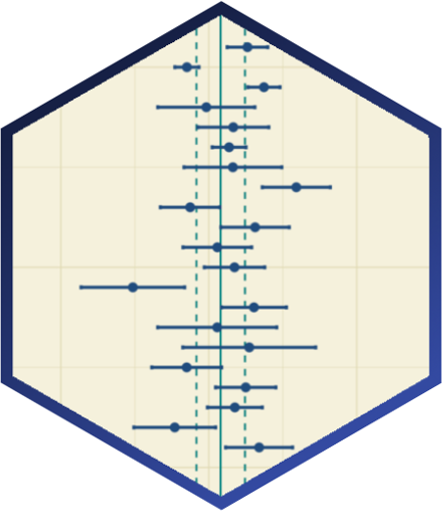

---
# Project page
type: project
title: "How Has the Last Decade Influenced Meta-Analytical Reporting and Practice Quality?"
tags: ["statistical practice", "meta-analysis"]
abstract: Avery, R. A. T., Kamar, M., Sladekova, M., Field, A. P. A review of over 160 meta-analytic papers in psychology. We were interested in whether the researchers report sufficient amount of detail about their models and make methodological choices in line with the  existing guidelines. 

# Homepage is headless, other widget pages are not.
headless: false
---

<h5 style="display:block; margin-top:-3px;"> Avery, R. A. T., Kamar, M., Sladekova, M., Field, A. P. </h5>

 

**Stage:** Manuscript in preparation. 

 

 

Meta-analysis is an important tool for quantitatively synthesizing research findings. Its use has seen an exponential growth in the last decade. As any statistical method, meta-analysis can be misunderstood and misused, and the prevalent use of this method has led to the development of guidelines for reporting and the best practices for its application. This has come hand-in-hand with the ongoing methodological reform in psychology. 

We coded over 160 meta-analytic papers across different areas of psychology. We were interested in whether the researchers report sufficient amount of detail about their models in the write-ups of their meta-analyses. We also examined their methodological choices, and whether they attend to important methodological issues like heterogeneity, artifact correction, study non-independence, outliers, or [publication bias](/project_info/proj_pb). Importantly, we looked at the change in the reporting practice between 2008 and 2018 which marks the introduction of the second edition of the PRISMA guidelines. 

**Data and materials:** https://osf.io/ruvhd/

**Preregistration:** https://osf.io/7zyvc

 

 
<a href = "/project_list"> List of all projects </a>

