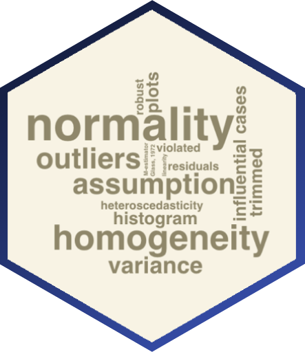

---
# Project page
type: project
title: "Evaluating the Reporting Practice in Psychology Using Natural Language Processing"
tags: ["statistical practice", "machine learning"]
abstract: Sladekova, M., Field, A. P. Large scale review of reporting practices in published psychology journal articles. The review focuses on the prevalence of the application of OLS models, assumption-related reporting, and the misconceptions that researchers hold about OLS assumptions. 

# Homepage is headless, other widget pages are not.
headless: false
---

<h5 style="display:block; margin-top:-3px;"> Sladekova, M., Field, A. P.</h5>

 

**Stage:** Data collection and model training 

 

 
 
Reporting related to the statistical assumptions of OLS is rare in psychology journals. What's reported in papers may not necessarily correspond to practice because of limitations like the word limits or editorial decisions. It is nevertheless an indication of what is and isn't important for an informed interpretation of the analysis. This study aims to quantify the prevalence of OLS models in psychology as well as the frequency of assumption-related reporting and the application of robust methods. By examining the published reports, we are also hoping to learn about some common misconceptions that researchers hold about the OLS assumptions. 

Prior research tended to focus on fairly small samples restricted to specific journals. By using Natural Language Processing and supervised machine learning, we are able to expand the sample to cover a large proportion of all psychology papers published in the past 10 years. We are training several machine learning models to identify the type of analysis applied in a paper, and detect and classify statements related to OLS assumptions or robust methods. 

 

 
<a href = "/project_list"> List of all projects </a>

