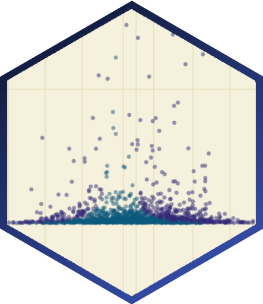

---
# Project page
type: project
title: "Estimating the Change in Meta-analytic Effect Size Estimates after the Application of Publication Bias Adjustment Methods"
tags: ["statistical practice", "publication bias", "meta-analysis"]
abstract: Sladekova, M., Webb, L. E. A., Field, A. P. A project investigating how published meta-analytic estimates change after they are adjusted for the presence of publication bias. Over 400 datasets were reanalysed with adjustment methods and performance was compared across different conditions.

# Homepage is headless, other widget pages are not.
headless: false
---

<h5 style="display:block; margin-top:-3px;"> Sladekova, M., Webb, L. E. A., Field, A. P. </h5>

 

**Stage:** Manuscript under review.

 

 

Statistically significant findings are more likely to get published than non-significant findings, which means that a considerable proportion of research findings ends up unpublished in the researchers' file drawers. Publication bias therefore represents a barrier in the way of accurately synthesising research findings using [meta-analysis](/project_info/proj_ma). A number of statistical methods have been developed in an attempt to address this problem by adjusting the meta-analytic estimates for potential presence of publication bias. 

Some of the newer methods include Trim-and-Fill, Precision-Effect Test, Precision-Effect Estimate with Standard Errors, Weighted Average of Adequately Powered Studies, *p*-curve, *p*-uniform, and Selection Models. All of these methods have different strengths and weaknesses, and they will produce adjusted estimates with varying accuracy depending on the situation they are used in. This project examined how the estimates in published meta-analyses change after they are adjusted for the presence of publication bias with one of these methods. 

We collected a sample of over 400 meta-analyses from 90 published papers. The adjustment method for each meta-analysis was selected depending on the characteristics of the meta-analytic sample - this meant that for each study, the adjustment that was known to perform with minimal bias was applied. We compared how the estimates changed across the different methods, but also how they changed when we made different different assumptions about the level of publication bias and the population effect size. 

**Data and materials:** https://osf.io/k9hqm/ 

**Preregistration:** https://osf.io/kxjs3

 

 
<a href = "/project_list"> List of all projects </a>

