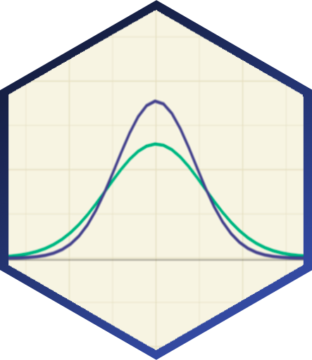

---
# Project page
type: page

# Homepage is headless, other widget pages are not.
headless: false
---

# Data and Models in Psychology
##### Sladekova, M., Jakeman, H., Field, A. P.

 

**Stage:** Data analysis completed for a pilot study. 

 

Psychology researchers routinely utilise General Linear Models (GLM) - like ANOVA or the *t*-test - as part of their statistical analyses. GLMs use Ordinary Least Squares estimation, which requires a number of statistical assumptions to be met in order to produce accurate and efficient estimates. With outliers present in the sample, the estimates become biased, while violations of normality and heteroscedasticity can lead to inefficiency and a loss of statistical power. 

This study has two main goals. First, we want to find out to find out what the data and models in psychology look like - what does the typical distribution of residuals look like, and how common are outliers? 

Second, we want to estimate the potential impact these characteristics may have on OLS estimates - to what extent do the OLS estimates change when the models are re-fitted with alternative [robust estimators](/project_info/proj_robust) that don't rely on the same statistical assumptions? 

We are collecting data from public repositories linked to published papers and preprints. At a later stage, we will be contacting researchers who have previously expressed interest in providing some of their data. 

We're also interested in datasets that didn't make it through the publication process and remain hidden in the researchers' file drawers. If you're considering contributing some of your data or would like to learn more, [get in touch!](/contact) We'd love to hear from you. 

