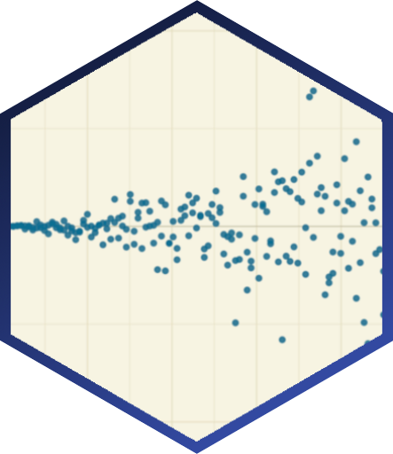

---
# Project page
type: project
title: "Statistical Practice of Psychology Researchers"
tags: ["statistical practice"]
abstract: Sladekova, M., Field, A. P. The aim of this project is to learn more about the statistical knowledge, understanding, and practice of psychology researchers with a specific focus on the statistical assumptions of OLS models and methods for detecting and addressing their violations.  

# Homepage is headless, other widget pages are not.
headless: false
---
<h5 style="display:block; margin-top:-3px;"> Sladekova, M., Field, A. P.</h5>

 

**Stage:** Data collection.

 

The aim of this project is to learn more about the statistical knowledge, understanding, and practice of psychology researchers. Previous research shows that applied researchers have gaps in their understanding of statistical concepts like *p*-values and confidence intervals. This project focuses on their understanding of the OLS assumptions and the extent to which violations can affect the analysis. We also want to learn about researchers' knowledge and application of methods for detecting and addressing violations of assumptions. 

This project comprises of two studies. In the first study, the researchers are asked to complete an online survey containing a knowledge test and some questions about their practice. In the second study, the researchers complete an analysis exercise where their task is to analyse to two dataset related to two research scenarios, and note down the steps of their analysis and their reasoning along the way. 

 

 
<a href = "/project_list"> List of all projects </a>

